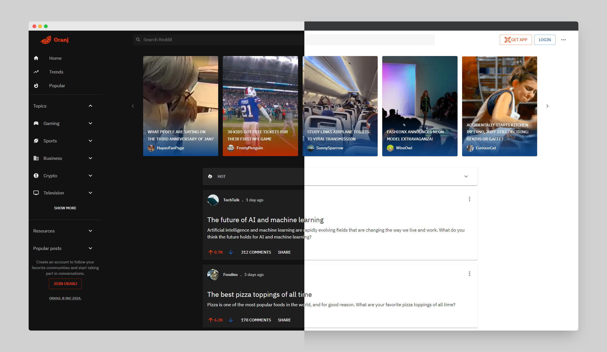
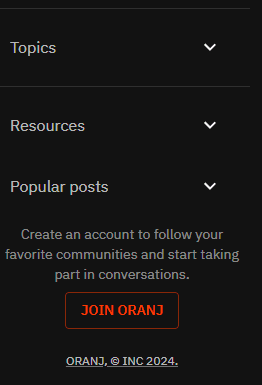

<p align="center">
  
</p>


# Oranj

Whether you're building a forum, discussion platform, or any other community-driven app, **Oranj** provides a couple of useful components for rapid development.

<br>

## Features

- **Dynamic Stories:** Keep users engaged with the unique Hot and Cold indicators. *Stories that are gaining popularity turn vibrant orange, while those receiving less attention adopt a cold blue hue.*

- **Data-Driven Menus:** Menus that are shaped by data.

- **Lazy Loading Posts:** Load content as users scroll, ensuring a smooth and efficient browsing experience.

<br>

## Customization
### Menus
To create a simple menu, you can define it as follow

```javascript
const menu = [
  {text: "Home"},
  {text: "Our Services"},
  {text: "Contact Us", MainIcon: ContactIcon} // Or we can add icons to any item we want
]
```

<br>

however what's important is that menus will be shaped according to the data that you feed it, for example
if I want to add switches, nested lists, dividers, buttons ... I can easily just plug them without worrying about anything else

```javascript
const userProfileItems = [
  {type: "section", text: "Settings", data: settings}, // section with switches
  {type: "divider"}, // divider for asthetics
  {text: "Help Center", MainIcon: HelpIcon}, // Normal menu item
  {type: "nested", text: "More", MainIcon: ReadMoreIcon, data: moreCategories}, // nested menu within the current menu
  ...
  {text: "Log In / Sign Up", MainIcon: LoginIcon},
];
```

The result would be something like the following:


<br>
<br>

Speaking of nested menus, you can easily create a nested menu within another menu or a nested `DropDownList` with as many levels as you want
all you have to do, is add `isNested: true` to root. and the rest will be taken care of.

```javascript
{isNested: true, data: your-data}
```

below is an example with of a drop down list that contains another drop down lists



<br>
<br>

We can nest as deeply as we want, not that it is a good UX experience, but just to demonstrate
how easy it is to compose these components together.

But what will happen if I load it with too much content, does it overflow?
Each **Oranj** component comes with a safety fallback, so in our previous example if we injected a lot of data into our menu
instead of overflowing it will just show an `n` item and a `show more`. (of course `n` can be customized)


<br>
<br>

### Infinite Scroll
By default the `Post` component will fetch 4 posts at a time, you can customize it to fetch more.

fetching is triggered when the user scrolls to the end of the page.


<br>
<br>

### Stories
By default, on mobile you swipe for the next or previous stories


<br>
<br>

however you can customize to show many stories per breakpoint, easily like so

```
{xs: 1, sm: 2, md: 3, lg: 4}
```


<br>
<br>

**Stories have hot and cold indicators, from your data it will be determined which stories are getting more attention and which are not**

<br>
<br>

### Posts
Posts are simple, there are four types

1. Posts with titles only (question posts)
2. Posts with titles and inner text
3. Posts with media (images and videos)
4. Posts that are links

the type of the posts will be determined automatically from your data, nothing is needed to be done.

<br>
<br>

## Getting Started

To get started with Oranj, follow these steps:

```bash
$ pnpm install
$ pnpm dev
```


<br>
<br>

## License
This project is licensed under the MIT License.

<br>
<br>

Feel free to reach out at [Twitter](https://twitter.com/cipherlogs) for any questions or feedback.

Happy community building!
