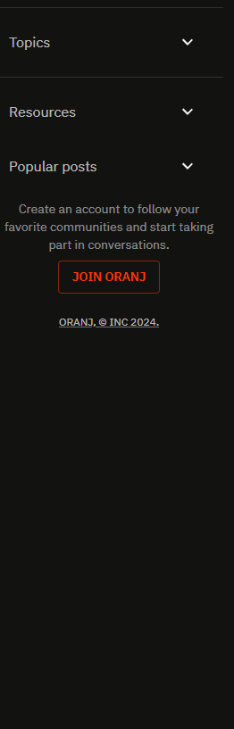

<p align="center">
  
</p>


# Oranj

Whether you're building a forum, discussion platform, or any other community-driven app, **Oranj** provides a couple of useful components for rapid development.

<br>

## Features

- **Dynamic Stories:** Keep users engaged with the unique Hot and Cold indicators. *Stories that are gaining popularity turn vibrant orange, while those receiving less attention adopt a cold blue hue.*

- **Data-Driven Menus:** Menus that are shaped by data.

- **Lazy Loading Posts:** Load content as users scroll, ensuring a smooth and efficient browsing experience.

<br>

## Customization
### Menus
Creating a simple menu in **Oranj** is straightforward. You can define it as follows:

```javascript
const menu = [
  {text: "Home"},
  {text: "Our Services"},
  {text: "Contact Us", MainIcon: ContactIcon} // Or we can add icons to any item we want
]
```

<br>

However, the beauty lies in the flexibility of shaping menus based on the data you provide.
For instance, adding switches, nested lists, dividers, buttons, and more can be seamlessly incorporated without any hassle:

```javascript
const userProfileItems = [
  {type: "section", text: "Settings", data: settings}, // section with switches
  {type: "divider"}, // divider for asthetics
  {text: "Help Center", MainIcon: HelpIcon}, // Normal menu item
  {type: "nested", text: "More", MainIcon: ReadMoreIcon, data: moreCategories}, // nested menu within the current menu
  ...
  {text: "Log In / Sign Up", MainIcon: LoginIcon},
];
```

The result is a dynamic menu with various item types:


<br>
<br>

Nested menus are a breeze to create within another menu or a nested DropDownList with as many levels as needed.
Just add `isNested: true` to the root, and everything else is taken care of:

```javascript
{isNested: true, data: your-data}
```

<br>

Here's an example of a two-level nested drop-down menu:


<br>
<br>

You can nest as deeply as required, with each **Oranj** component equipped with a safety fallback. If the content overflows,
it gracefully shows a limited set of items and a "show more" option (customizable):



<br>
<br>

### Infinite Scroll
The default behavior of the `Post` component is to fetch 4 posts at a time, triggered by scrolling to the end of the page (customizable):


<br>
<br>

### Stories
By default, on mobile, you can swipe for the next or previous stories:


<br>
<br>

Customization options include determining how many stories to show per breakpoint:

```
{xs: 1, sm: 2, md: 3, lg: 4}
```


<br>
<br>

**Stories feature hot and cold indicators, dynamically determined based on your data to showcase the level of attention each story receives.**

<br>
<br>

### Posts
Posts are versatile, coming in four types:

1. Posts with titles only (question posts)
2. Posts with titles and inner text
3. Posts with media (images and videos)
4. Posts that are links

The type of each post is automatically determined from your data without requiring any additional configuration.

<br>
<br>

## Getting Started

To get started with Oranj, follow these steps:

```bash
$ pnpm install
$ pnpm dev
```

I'm on [Twitter](https://twitter.com/cipherlogs) feel free to follow or reach out if you have any questions or need further assistance!

Happy community building!


<br>
<br>

## License
This project is licensed under the MIT License.
